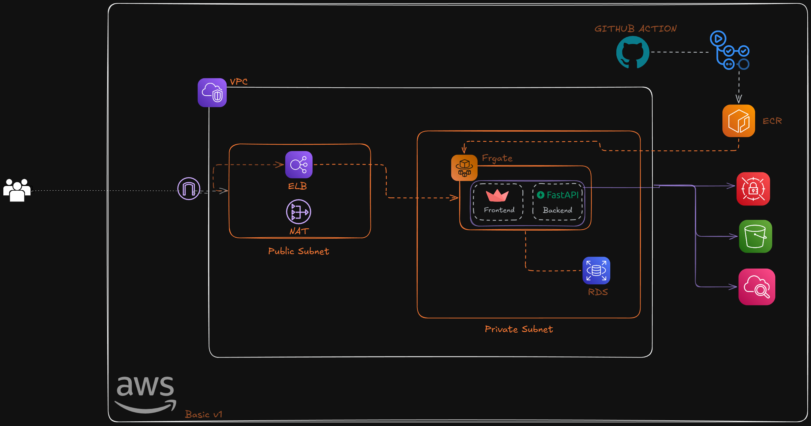

# 🤖 RSS Chat Assistant ✨

🚀 AI-powered RSS reader with AI chat using AWS Bedrock Nova Lite! 

> **💡 Note:** This project is just the beginning of a great idea! 🌟

## 🎯 What it does
- 📰 Add RSS feeds
- 💬 Chat with AI about your feed content  
- ☁️ Runs on AWS (ECS, RDS, S3)

## 🚀 Quick Start

### 1. 📥 Clone
```bash
git clone https://github.com/XxrzxX/mini-rss-ai
cd mini-rss-ai
```

### 2. 🚀 Deploy
```bash
cd terraform
cp terraform.tfvars.prod.example terraform.tfvars
# Edit terraform.tfvars with your values
terraform init && terraform apply
````

### 3. 🎉 Use
Open the URL from deploy output and start chatting with your RSS feeds! 💫

## 📋 What you need
- ☁️ AWS account
- 🔧 AWS CLI configured
- 🏗️ Terraform installed
- 🐙 Github account

## 🏗️ Architecture


## 📄 License
MIT 📜
